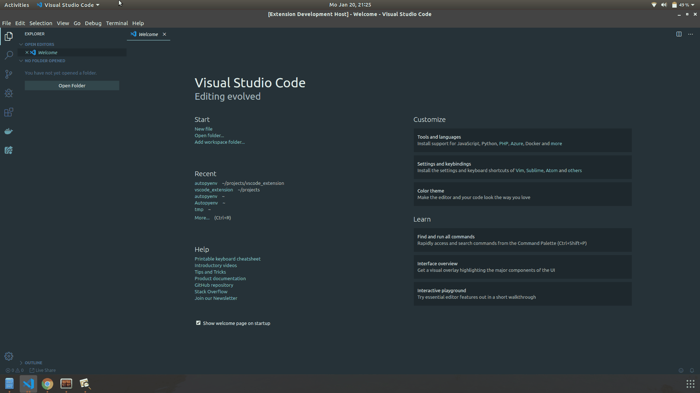
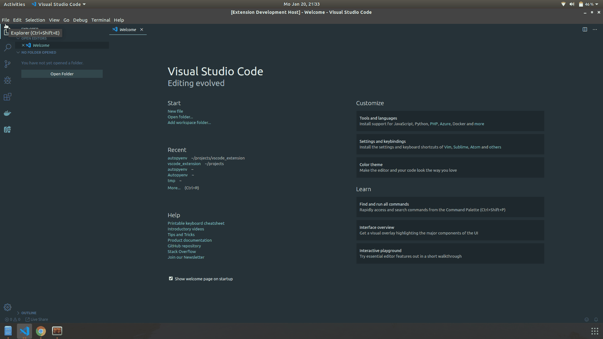

# autopyenv

This extension lets you create and manage a virtual environment for your python project. Ideal for developers working in large teams who manages a lot of python packages.

By default it utilizes pythons built in virtual environemt module so there is no extra dependencies to be installed. Support for `Anaconda` and other virtualization modules is planned in the next release.

## Features

It works by checking if you have `.vscode` directory in your current working directory. If there is no `.vscode` directory, it will create that directory and create a virtual environment in that directory. However, you have the ability to customize this setting and add your own directory if you so desire.

To activate `autopyenv`, you first need to be inside your desired directory where you would like `autopyenv` to create a virtual environment for you and then press `ctrl+shift+p` for linux and windows and `⇧⌘P, F1` on mac os to bring up command palette, then type `autopyenv` and hit enter to create a new environment in the current directory. 

If you already have create an environment using `autopyenv` then you can follow the above command and it will ask you if you want to activate the environment present in your `.vscode` directory or other directory if you have selected your own directory from settings.

## Extension Settings

This extension contributes the following settings:

* `autopyenv.configFolder`: sets new directory for environment

## Requirements

This extension requires vscode enginee version `1.41.0` or higher